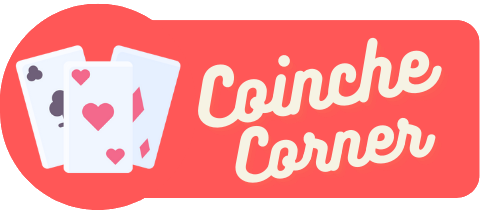

# Coinche corner
This is a personal project that I develop on my free time. It's a web application which wants to show us who is the best 
Belote player between my teammates.

## Plateforme
This website is optimized for a mobile screen. It does not look good on a laptop.

## Hosting
The application is hosted on a Digital Ocean App. The public url is https://teamboulding.fr.

## CI/CD
Code is automatically deployed on each commit on main branch. Tests are executed first, then I build and 
push docker images on dockerhub, one for the front and another one for the back. Finally, I call Digital Ocean API to 
redeploy my app. I use github actions for that.

## Techno
Is use FastAPI for the backend with a PostgreSQL database and the front is build in Angular. The generated static files 
for the frontend are served through Nginx.

## API
You can fin the swagger here https://teamboulding.fr/api/docs
